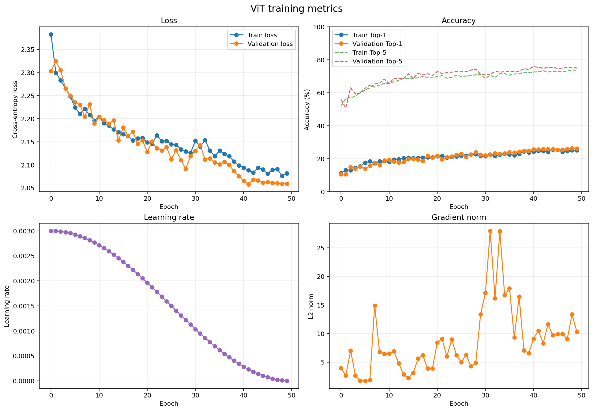
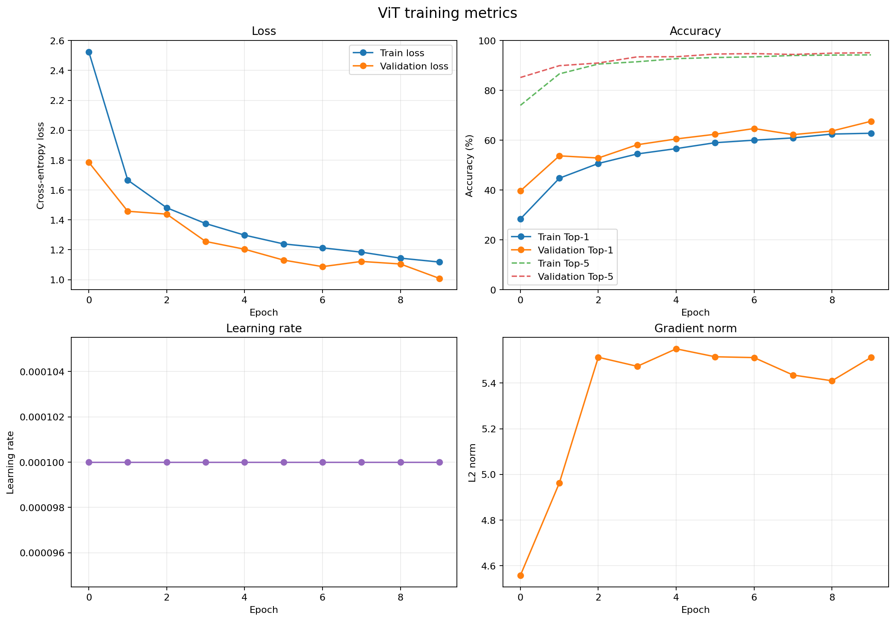
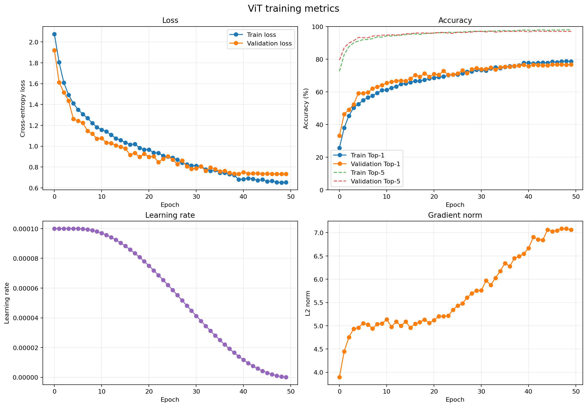
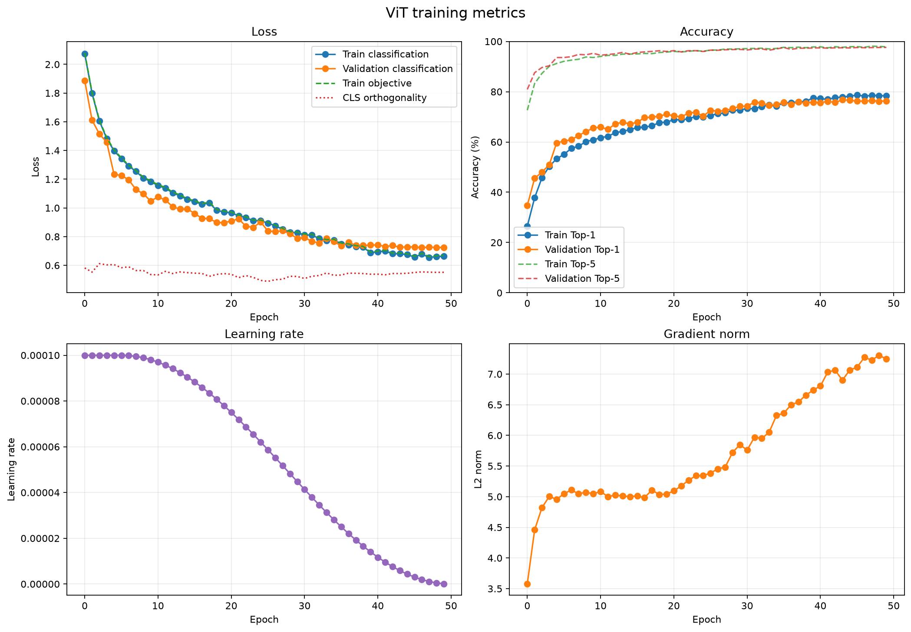

# myvit 实验文件

主要使用 ChatGPT Sol-5.6 完成代码生成和实验理解。

## 1. 模型代码 2026.9.1

`src/myvit/vit.py` 主要涉及 Transformer Block / MLP 等模块的实现。以此复习了注意力机制的原理，熟悉 PyTorch 的代码实现方式。

## 2. 训练代码 2026.9.1

学习了该如何关注训练代码的指标。包括

- Epoch 轮次
- Top1 & Top5
- Accuracy
- 梯度 L2 norm
- loss

等。

一段训练代码的核心逻辑在

```Python
for epoch in range(num_epochs):
    for images, targets in train_loader:
        optimizer.zero_grad()

        logits = model(images)
        loss = criterion(logits, targets)

        loss.backward()
        optimizer.step()

    validation_metrics = evaluate(model, val_loader)
    scheduler.step()
    save_checkpoint()
```

通过 debug 工具观察上述过程中部分梯度矩阵，张量形状等变化。

## 3. 训练一个小模型

在 `src/myvit/tiny_training.py` 的配置中:

```Python
def create_tiny_model() -> VisionTransformer:
    return VisionTransformer (
        image_size=224,
        patch_size = 16,
        embed_dim = 192,
        depth = 12,
        num_heads = 3,
        num_classes = 1000,
    )
```

数据集是 `data/imagenette2-320`，在小样本内有10个分类的若干图片，训练集与测试集分开。

学习率采用余弦衰减优化，梯度更新采用 `AdamW` 方法。

训练50轮，并通过 AI 生成的可视化辅助脚本得到



显示准确度只有25%左右，基本确定模型是**欠拟合**。

初步猜测原因在 `num_classes = 1000` 输出维度是1000，但是实际上只使用了10个维度，但是未必是原因所在：**落在剩下类别当中**的频率显然会被修正。

将 `num_classes` 修改后再尝试将学习率调整成 `1e-2` 重新运行，训练轮数10轮。得到 26.68% 的准确率。

仍然可能是欠拟合，因此先不对 Scheduler 加衰减策略；先采用 StepRL；训练10轮，得到 17.22%。说明该学习率过大。

改为 `1e-4` 后达到了 67.57% 的效果。通过调参过程可以知道，**学习率大小是一个重要因素**。



改为50轮次，前5轮采用固定步长 Warmup, 后45轮用余弦衰减；在43轮时得到最优结果 77.38%。（在下文对照试验中得到 75.75%）

## 4. 尝试对照实验



设置了3个 CLS-Tokens，结果取平均；得到的结果是76.74%，结论：并没有显著增强。

设置断点检查输出时的余弦相似度

```Python
torch.cosine_similarity(tokens[0], tokens[1])
```

得到 `0.8904` `0.9012` `0.7947` （两两之间），这说明三个 Token 的判断方向趋同。

将这三个参数设置为可学习，得到



仍然没有明显提升。
